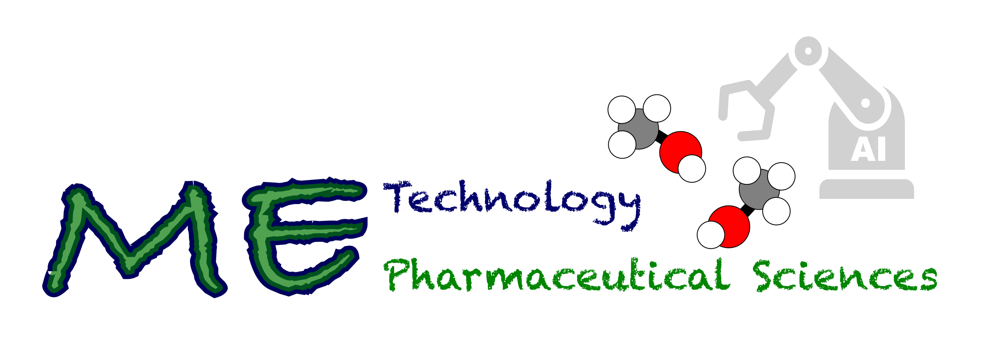

# 2. Current Projects 🥼 , Fundings 💰 and Collaboration ✈️ :

###### Go back to the first page [Click](../README.md)

&nbsp;

## *Current Projects 🥼 :*

&nbsp;

- FARM-BIOMOL chemical library establishment   [*Click*](https://pharmbio-fau-erlangen.github.io/FARM-BIOMOL/)

- Molecular simulation, AI, and natural products-based anti-infective drug discovery research
  
&nbsp;&nbsp;&nbsp;&nbsp;&nbsp;&nbsp;&nbsp; " 🚨🚧 Information of the project is under construction 🚧🚨"

&nbsp;

## *Fundings 💰 and Collaboration ✈️ :*

__2023 - Project-related exchange for scientists (Projektbezogener Wissenschaftleraustausch), BayCHINA__

&nbsp;&nbsp;&nbsp;&nbsp;&nbsp;&nbsp;&nbsp;&nbsp;&nbsp;&nbsp;&nbsp;&nbsp; __Host:__ *Prof. Yanjie Wei*

&nbsp;&nbsp;&nbsp;&nbsp;&nbsp;&nbsp;&nbsp;&nbsp;&nbsp;&nbsp;&nbsp;&nbsp; __Project:__ *Combining Molecular Simulation and Machine Learning for Drug Screening.*

&nbsp;

&nbsp;&nbsp;&nbsp;&nbsp;&nbsp;&nbsp;&nbsp;&nbsp;&nbsp;&nbsp;&nbsp;&nbsp; 

&nbsp;&nbsp;&nbsp;&nbsp;&nbsp;&nbsp;&nbsp;&nbsp;&nbsp;&nbsp;&nbsp;&nbsp; 

