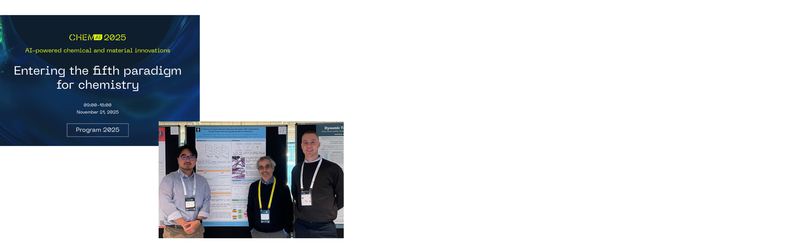
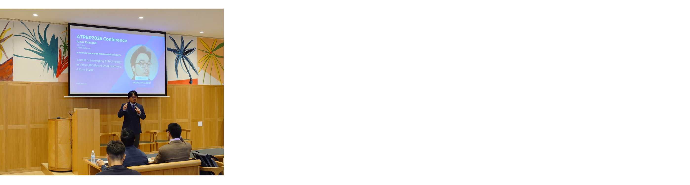
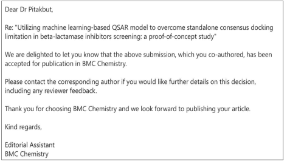
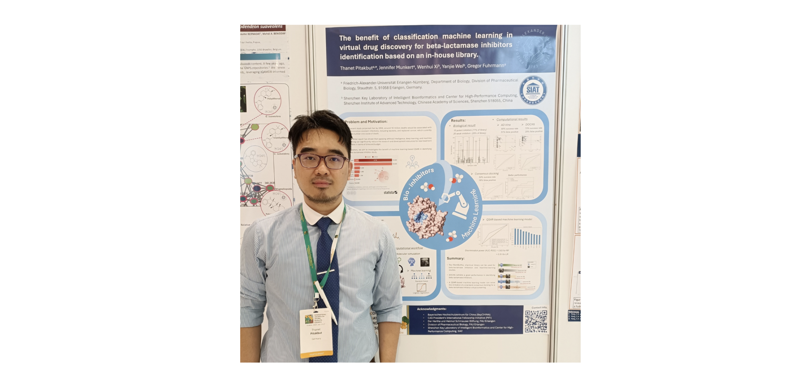

&nbsp;

## 1. News and updates 🚀🌓

###### Go back to the first page [Click](../README.md)

&nbsp;
### - 2025 November

We are excited to share a preliminary result from our project on identifying patterns in insect olfaction using machine learning at ChemAI 2025, organized by the University of Amsterdam. This initial finding was achieved by Michael Herzog (Bachelor student) under the supervision of all PIs. Well done!!!

#### - 2025 September

I received an oppotunity to talk and discuss about the potential of my previous project on AI and Thailand development at APTER 2025, Gent, Belgium.

#### - 2025 April

I have started my new position athethe Institute for Biodiversity and Ecosystem Dynamics (IBED), University of Amsterdam (UvA), the Netherlands.

#### - 2024 October

Good news!!! My first manuscript on ML, digital drug discovery, and natural products against resistant bacterial infection was accepted for publication in BMC Chemistry Journal under the Chemistry and Machine Learning collection.

Another paper is out!!! With collaboration from a Thai partner, I performed a molecular simulation supporting  a biological experiment. We found some interesting findings! Please check it out :)

Here is a link: [Click](https://www.mdpi.com/2075-1729/14/11/1400)

#### - 2024 July

Fruitfull discussion my project with international experts and research at the International Congress on Natural Products Research, which was organized by GA and co-organized by multiple international natural products scientific associations, such as DFERP (France), ISF (Italy), PSE (EU), ASP (USA), JSP (Japan), and KSP (Korea).

###### Go back to the first page [Click](../README.md)
###### Copyright © 2025 by Thanet Pitakbut. All rights reserved.
